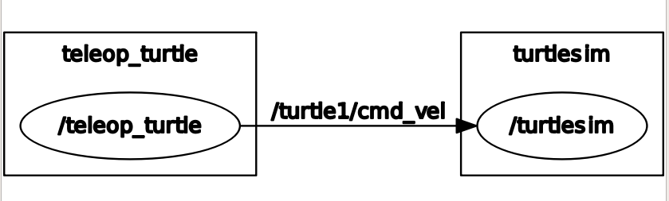

# ROS tutorial for turtle


## start roscore main server
```
roscore
```

## start ros sim 
```
(new shell)

rosrun turtlesim turtlesim_node

[ INFO] [1505445824.103304942]: Starting turtlesim with node name /turtlesim
[ INFO] [1505445824.112405654]: Spawning turtle [turtle1] at x=[5.544445], y=[5.544445], theta=[0.000000]


```

## start teleprompt
```
(new shell)

rosrun turtlesim turtle_teleop_key
Reading from keyboard
---------------------------
Use arrow keys to move the turtle.

```
(new shell)


## get graph
```
rosrun rqt_graph rqt_graph
```


